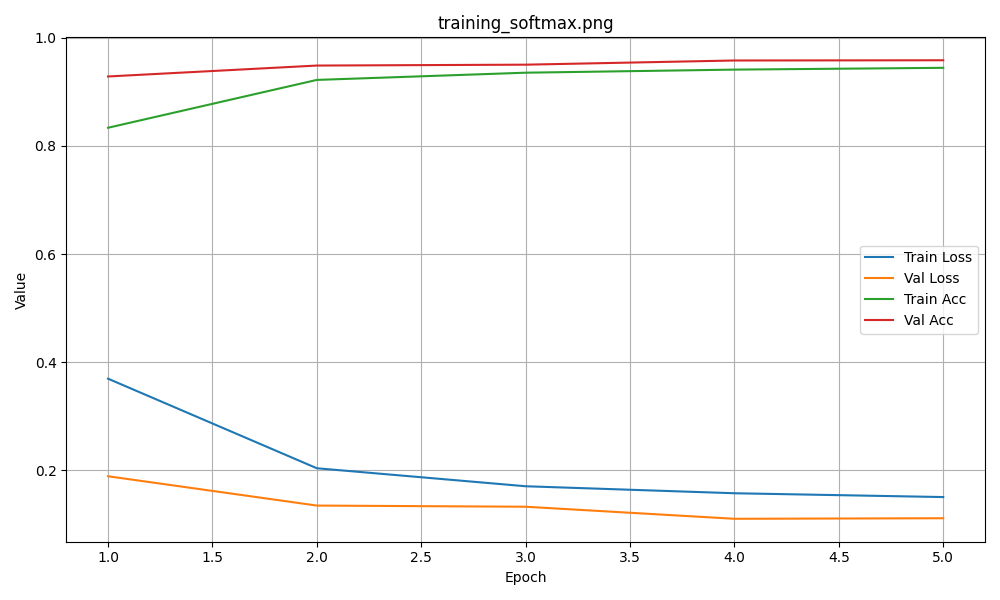
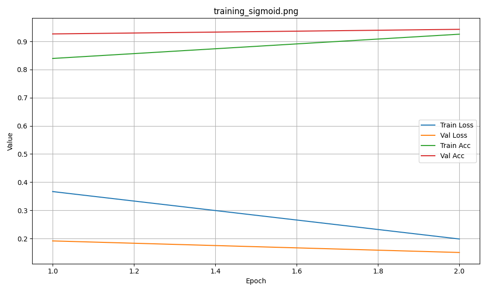
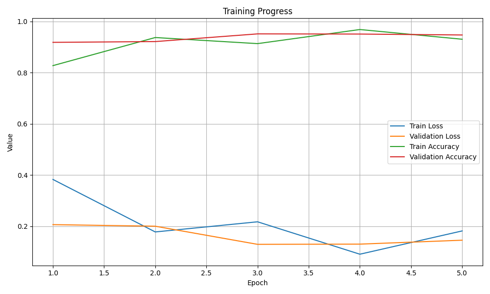

# Gender Classification Using CNN: Softmax vs Sigmoid

## Overview

This project focuses on **gender classification from facial images** using a convolutional neural network (CNN). The main goal is to compare the performance of two output activation strategies: **Softmax** and **Sigmoid**, and evaluate which one provides better results for binary classification on this dataset.

The dataset used is the **Gender Classification dataset from Kaggle**, split into training and validation sets.

---

## Dataset

* **Training images:** 47,009
* **Validation images:** 11,649
* **Classes:** `male`, `female`
* Images are organized in a folder-based structure: `Training/male`, `Training/female`, etc.
* Data augmentation applied: rotation, width/height shift, horizontal flip

---

## Model Architecture

A CNN was designed using a **custom Keras Model subclass** (instead of `Sequential`) to demonstrate deeper understanding and professional usage of the Keras API:

* 3 convolutional layers with increasing filters (32 → 64 → 128), using `padding="same"`
* MaxPooling after each convolutional layer
* Flatten layer
* Dense layer with 100 units and `ReLU` activation
* Output layer: **Softmax with 2 units** for the primary model

### Why Softmax?

* Produces a normalized probability distribution over the two classes
* Works naturally with **categorical cross-entropy**
* Ensures `p_male + p_female = 1`, which fits mutually exclusive classes
* Provides clearer probabilistic interpretation

### Why not Sigmoid?

* Sigmoid is typically used for **independent binary outputs**, often in multi-label problems
* Does not enforce probability normalization across classes
* Less expressive when classes are strictly mutually exclusive

---

## Training

* **Batch size:** 32
* **Epochs:** 5
* **Optimizer:** Adam
* **Loss function:** categorical_crossentropy
* **Metrics:** accuracy + custom F1Score
* Training monitored using a **custom Keras callback** that:

  * Tracks loss and accuracy
  * Identifies the best validation epoch
  * Saves training plots automatically

---

## Training Plots

**Softmax Model:**

**Sigmoid Model:**

---

## Results

| Model   | Accuracy | F1-Score | Notes                                                               |
| ------- | -------- | -------- | ------------------------------------------------------------------- |
| Softmax | 95.8%    | 0.95     | Higher overall accuracy and more stable convergence                 |
| Sigmoid | 94.7%    | 0.94     | Slightly lower performance; better suited for multi-label scenarios |

**Observation:**
The Softmax model converged more consistently and achieved a higher validation F1-score. While Sigmoid performs reasonably well, its probability interpretation is less natural for a strictly two-class problem.

---

## Confusion Matrix

A confusion matrix can be generated to analyze misclassifications and class-wise performance using the trained models.

---

## Model Files

* [Current Model](softmax_vs_sigmoid/model/gender_net.keras)
---

## Plot Files

---

## Summary

* Compared **Softmax vs Sigmoid** for binary gender classification
* Implemented a CNN using **Keras Model subclassing**
* Used **custom callbacks and custom F1-score metric**
* Applied data augmentation to reduce overfitting
* Achieved high validation accuracy (≈95–96%)
* **Softmax is recommended** for binary classification with mutually exclusive classes
